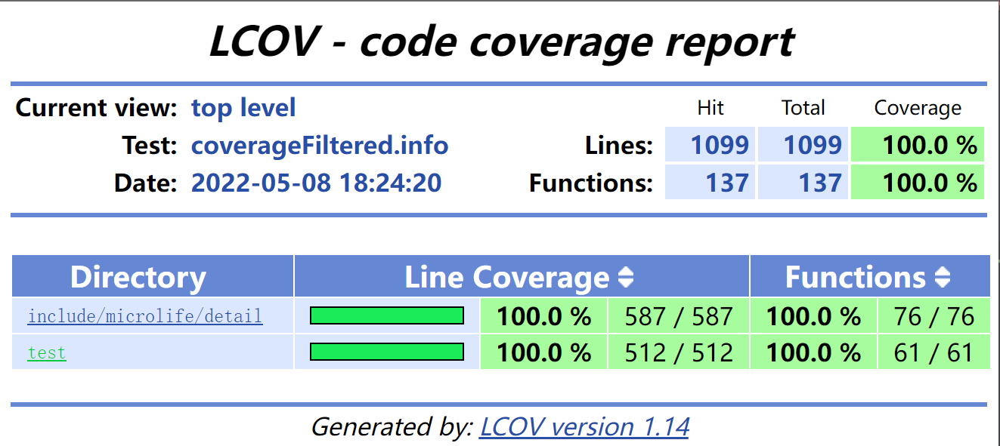

# microlife-json

> 符合标准的 JSON 解析器和生成器

- 符合标准的 JSON 解析器和生成器
- 仅由头文件构成
- 模板支持
- 跨平台 linux/windows
- 跨编译器 gcc/msvc
- 单元测试 gtest
- 代码覆盖率 lcov/VS2022，覆盖率达到 100%

    

## build

- `bash build.sh` 来构建并运行项目
- `bash build.sh clean` 清理项目
- `bash build.sh rebuild` 重新构建项目
- `bash build.sh test` 运行单元测试，并使用 lcov 生成代码覆盖率报告
- `bash build.sh help` 获取更多信息

## Usage

- 解析 json

```cpp
int main() {
    json j;
    j.parse("{\"a\":1,\"b\":2}");

    std::cout << (j.is_object() ? "is object" : "not object") << std::endl;

    auto a = j.get<json::object_t&>().find("a");
    auto b = j.get<json::object_t&>().find("b");

    std::cout << a->first << ": " << a->second << std::endl;
    std::cout << b->first << ": " << b->second << std::endl;
}
```

-   序列化 json 数据

```cpp
int main() {
    json::object_t object;
    object["a"] = 1;
    object["b"] = 2;

    json j = object;
    std::cout << j.dump() << std::endl;
}
```

-   json 数据的操作

```cpp
int main() {
    json json_null = nullptr;
    std::cout << json_null.type() << ": ";

    json json_bool = true;
    std::cout << json_bool.type() << ": ";
    std::cout << json_bool.get<bool>() << std::endl;

    json json_num = 3.14;
    std::cout << json_num.type() << ": ";
    std::cout << json_num.get<double>() << std::endl;

    json json_str = "hello json";
    std::cout << json_str.type() << ": ";
    std::cout << json_str.get<std::string>() << std::endl;

    json json_array = json::array_t({1, 2, 3});
    std::cout << json_array.type() << ": ";
    std::cout << json_array.get<json::array_t&>()[0] << std::endl;

    json json_object = json::object_t({{"a", 1}, {"b", 2}});
    std::cout << json_object.type() << ": ";
    std::cout << json_object.get<json::object_t&>().at("a") << std::endl;

    std::cout << std::endl;
    json json_cnt(3, true);
    std::cout << json_cnt.type() << ": ";
    std::cout << json_cnt.get<json::array_t&>().size() << std::endl;
}
```

## Usage Notes

- 如果使用 vscode 建议修改 cmake 默认构建目录，避免和 `build.sh` 的构建目录冲突
- 如果编译失败，可能是 test/CMakeLists.txt 中的链接失效，请改为 github 上的链接（注意网络问题）
- 使用 Visual Studio 2022 生成代码覆盖率报告时，如果生成失败请直接关闭重进，就可以成功了

## License

[MIT](LICENSE)
