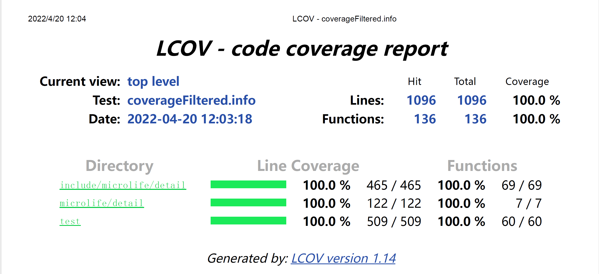

# microlife-json

> 符合标准的 JSON 解析器和生成器

- 符合标准的 JSON 解析器和生成器
- 跨平台 linux/windows
- 跨编译器 gcc/msvc
- 单元测试 gtest
- 代码覆盖率 lcov/VS2022，覆盖率达到 100%
    

## build

- `bash build.sh` 来构建并运行项目
- `bash build.sh clean` 清理项目
- `bash build.sh rebuild` 重新构建项目
- `bash build.sh test` 运行单元测试，并使用 lcov 生成代码覆盖率报告
- `bash build.sh help` 获取更多信息

## Usage Notes

- 如果使用 vscode 建议修改 cmake 默认构建目录，避免和 `build.sh` 的构建目录冲突
- 如果编译失败，可能是 test/CMakeLists.txt 中 gtest 的链接失效，请改为 github 上的链接（注意网络问题）
- 使用 Visual Studio 2022 生成代码覆盖率报告时，如果生成失败请直接关闭重进，就可以成功了

## License

[MIT](LICENSE)
